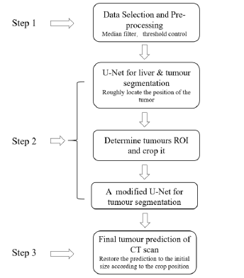
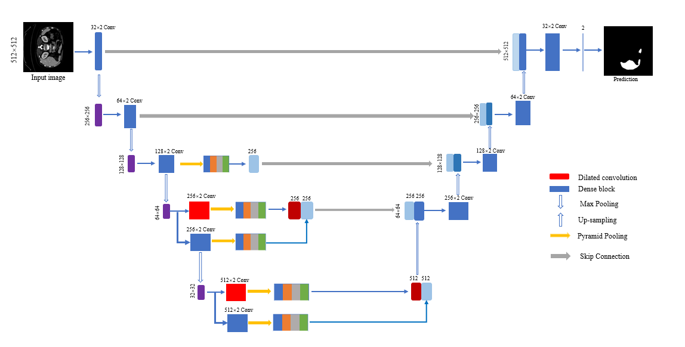
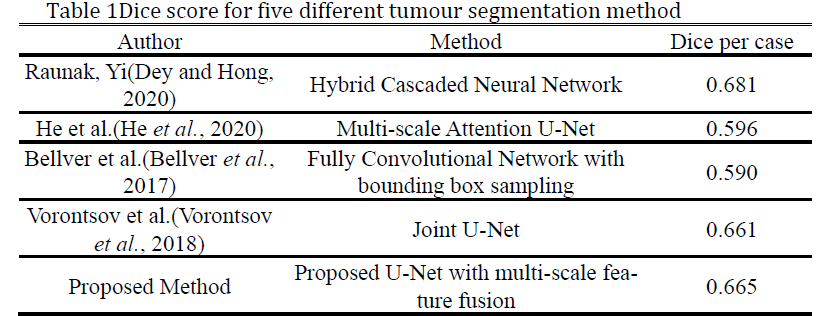

# MSF-UNet-Liver-Segmentation
Multi-scale feature fusion U-Net for liver tumour segmentation from CT images.
---

## Overview

This repository contains the implementation of **MSF-UNet**, a multi-scale feature extraction framework for automatic liver tumour segmentation from abdominal CT images.

The proposed method extends the conventional U-Net by incorporating residual learning and multi-scale feature fusion to improve feature representation and segmentation accuracy, particularly for challenging tumour boundaries.

The framework was developed during my PhD research at the **University of Strathclyde** and evaluated on the **LiTS Challenge Dataset**.

---

## Highlights

- Multi-scale feature extraction
- Modified U-Net architecture
- Residual feature fusion
- Lightweight design
- Automatic liver tumour segmentation
- LiTS Challenge Dataset

---

## 🔄 Overall Workflow

  

The complete workflow consists of CT image preprocessing, multi-scale feature extraction, liver tumour segmentation and quantitative evaluation.

---

## Network Architecture

  

The proposed MSF-UNet extends the conventional U-Net by incorporating multi-scale feature extraction and residual feature fusion to improve feature representation and segmentation accuracy.

---

## 📊 Segmentation Results

  

Representative qualitative segmentation results on the LiTS Challenge dataset.
